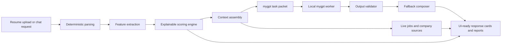

# InterviewPal v4

InterviewPal is a privacy-first local AI career copilot built around `mygpt`.

It analyzes resumes, scores internship readiness, searches live jobs and internships, generates interview prep, and produces downloadable reports using a custom local model plus deterministic parsing, scoring, and retrieval pipelines.

## Product direction

InterviewPal is intentionally designed to feel like one coherent local AI system:

- `mygpt` is the only public intelligence brand in the app
- deterministic parsing and scoring stay in control of structure and reliability
- local model outputs are validated before they ever reach the UI
- broken or low-confidence generations fall back to deterministic text
- uploaded resumes are processed in memory and discarded after analysis
- sign-in is only required for saved workspace items and persisted reports

The tone of the product is simple:

Built by a student, engineered seriously.

## What it can do

- run guest-first quick actions like Google internships, company prep, and bullet rewrite without sign-in
- analyze PDF and DOCX resumes securely in memory
- normalize uploaded resumes into a structured candidate profile
- score student and internship readiness with explainable dimensions
- search live jobs from official ATS and company sources first
- build company-aware interview prep and question sets
- rewrite bullets, generate coaching notes, and produce action plans through `mygpt`
- save encrypted workspace snapshots for authenticated users
- export reports as PDF or JSON

## System design



## Architecture layers

### 1. Deterministic parsing

- PDF and DOCX resume extraction
- multi-section normalization into candidate JSON
- skill extraction, evidence collection, and warning tracking

### 2. Deterministic reasoning

- education and graduation signals
- quantified bullet detection
- impact, collaboration, and ownership evidence
- role-family match and keyword gap detection
- internship-readiness scoring

### 3. mygpt task layer

`mygpt` is used for narrow, structured tasks:

- `coaching_note`
- `rewrite_bullet`
- `generate_questions`
- `summarize_company_context`
- `next_actions`
- `report_polish`

### 4. Validation and fallback

Before the UI renders local-model text, InterviewPal rejects outputs that:

- echo prompts
- repeat malformed fragments
- contain corrupted text
- exceed length constraints
- fail task expectations

When that happens, the app quietly switches to deterministic fallback wording instead of exposing broken output to the user.

## Security and privacy

- uploaded resumes are processed in memory and discarded after parsing
- saved workspace items store structured output only, not raw resume files
- saved workspace items are encrypted with `AES-256-GCM`
- accounts use `argon2id` password hashing
- sessions use `HttpOnly` cookies and CSRF protection
- API responses use `Cache-Control: no-store`
- local `mygpt` worker runs with network access disabled
- model checksum validation is supported through `MYGPT_MODEL_SHA256`
- OpenAI is owner-only and optional; the public UI is branded around `mygpt`

## Live data policy

InterviewPal prefers official and fresh sources whenever possible:

- official ATS and company job pages first
- public fallback only when official sources are weak or unavailable
- job cache target: 15 minutes
- company context cache target: 6 hours
- source freshness and fallback state are attached to results

Network availability still depends on the machine running the app. In restricted environments, the product falls back gracefully and labels that internally.

## Run locally

Install dependencies:

```bash
npm install
```

Create a `.env` file:

```bash
SESSION_SECRET=change-me
DATA_ENCRYPTION_KEY=change-me-too
INTERVIEWPAL_OWNER_EMAIL=you@example.com
INTERVIEWPAL_DB_PATH=
PORT=3000
OPENAI_API_KEY=
OPENAI_MODEL=
MYGPT_MODEL_SHA256=
```

See `.env.example` for the full key list.

Start the app:

```bash
npm start
```

Open [http://127.0.0.1:3000](http://127.0.0.1:3000).

## Stack

- backend: Node.js + Express 5, sqlite3, express-session (SQLite store)
- security: argon2id, AES-256-GCM, HttpOnly cookies + CSRF
- parsing: pdf-parse, mammoth (DOCX), tesseract.js (OCR fallback)
- jobs/company: cheerio (+ live ATS/company fetch with cache)
- local model: PyTorch char-level MiniGPT (`ml/`), Node eval/promote scripts
- tests: `node:test` + supertest (dev)

## Tests

```bash
npm test
```

Runs `test/offline.test.js` (9 tests: profile normalization, AES-GCM roundtrip, argon2, CSRF, scorecard bounds, resume-parser PDF/DOCX guards). No network or model required.

## mygpt workflow

Build the task corpus:

```bash
npm run build:mygpt-corpus
```

Train the current checkpoint:

```bash
npm run train:mygpt
```

Generate directly from the local model:

```bash
npm run generate:mygpt
```

Run task-level evals:

```bash
npm run eval:mygpt
```

Promote a checkpoint only after evals pass:

```bash
npm run promote:mygpt -- --candidate /absolute/path/to/candidate-model.pt
```

Promotion archives the previous checkpoint and updates `model_versions/manifest.json`.

## Training data layout

Task-specific corpora live in:

- `data/mygpt/coaching_note.jsonl`
- `data/mygpt/rewrite_bullet.jsonl`
- `data/mygpt/generate_questions.jsonl`
- `data/mygpt/next_actions.jsonl`
- `data/mygpt/report_summary.jsonl`

The builder script converts those files into `data/corpus.txt` for the current char-level local model.

## Eval suite

Eval cases live in:

- `evals/coaching_note_cases.json`
- `evals/bullet_rewrite_cases.json`
- `evals/question_generation_cases.json`
- `evals/report_summary_cases.json`

Each eval measures:

- format pass
- coherence pass
- prompt echo pass
- relevance score
- faithfulness score
- professionalism score
- fallback triggered

## Main API surface

- `GET /api/profile`
- `GET /api/auth/me`
- `POST /api/auth/signup`
- `POST /api/auth/login`
- `POST /api/auth/logout`
- `POST /api/auth/preferences`
- `POST /api/assistant/turn`
- `POST /api/analyze-resume`
- `POST /api/jobs/search`
- `POST /api/prep`
- `POST /api/reports`
- `GET /api/saved/*`
- `GET /api/account/export`
- `DELETE /api/account`
- `GET /api/advanced/diagnostics` owner only

## Known limitations

- the current `mygpt` checkpoint is still a small local model, so narrow task design matters a lot
- live jobs and company lookups depend on outbound network access from the host machine
- OCR fallback is still limited compared with dedicated document pipelines
- eval quality improves as task corpora grow; the starter datasets included here are scaffolding, not the finished training set
- OpenAI exists only as an owner-only advanced comparison path and is not the intended public product experience
